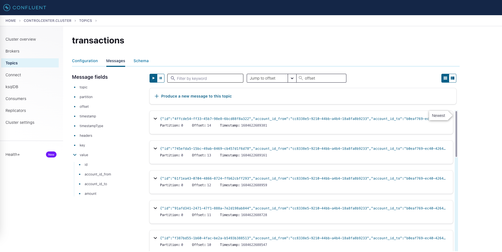

# Desafio EDA Full Cycle

Iniciar usando:
`docker-compose up --build`

Na raiz do projeto temos o arquivo "requests.http" onde já está configurado as chamadas usando a extensão API Rest do VSCode.

Para gerar uma transação basta executar a request com o POST para http://localhost:8080/transactions.

E usar o endpoint de balance para consultar o saldo:
http://localhost:3003/balances/cc8338e5-9210-44bb-a4b4-18a8fa8b9233

Já foram colocados valores para **account_id** que possuem saldo

## Como gerenciar e monitorar o Kafka?

No docker-compose fornecido temos uma instância do control-center.
Para acessar use:
```http://localhost:9021/clusters```

Exemplo de mensagens no tópico de transação:
